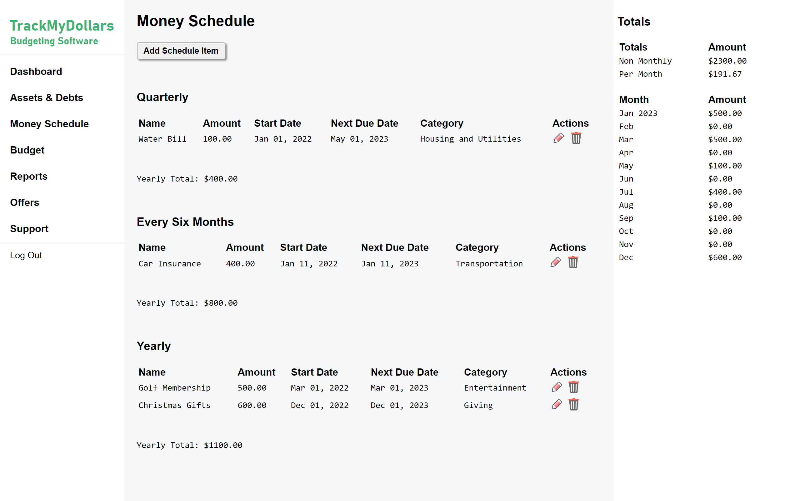

# Track My Dollars

## Description
This is source code for [trackmydollars.com](https://www.trackmydollars.com). This web app provides users a way to track their assets and debts, money schedule (i.e. recurring income/expenses), and monthly budgets. There are already many financial applications out there but many are missing crucial features that will improve the financial tracking process. The main difference is the functionality of our budgeting system. We make it easier for users to budget credit cards and cash and offer features that make budgeting less cumbersome.

## Features
* Dashboard
* Assets & Debts
* Money Schedule
* Budget
* Reports
* Offers
* Support

Check out some of our screenshots below:

